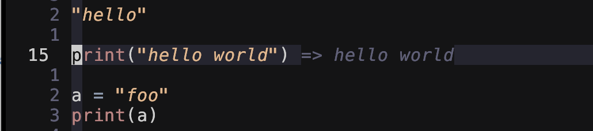
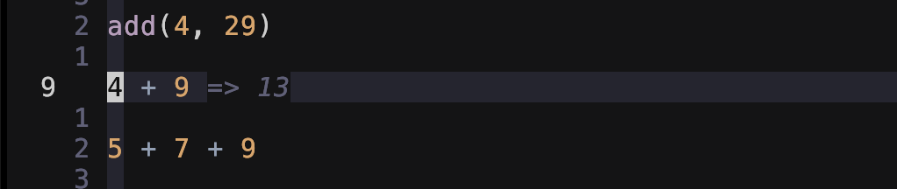
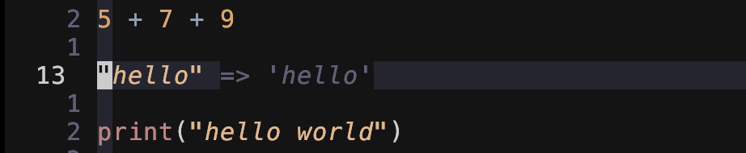
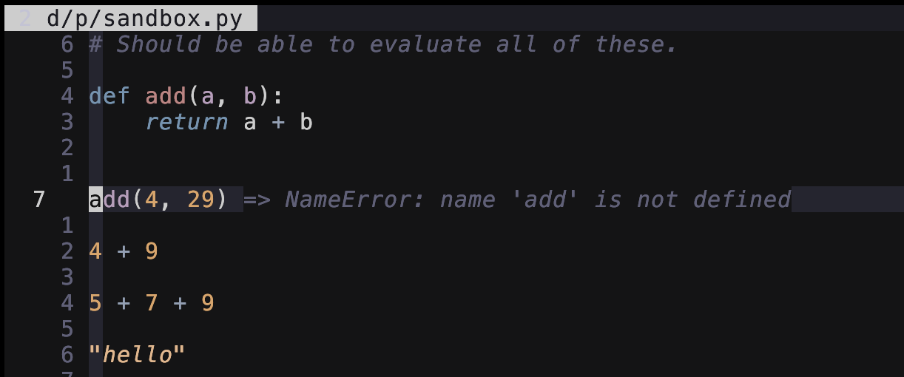
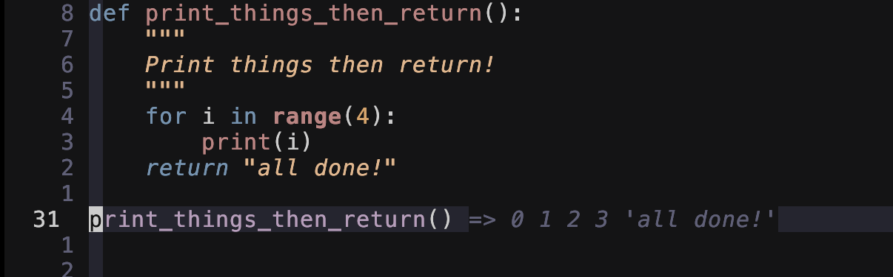
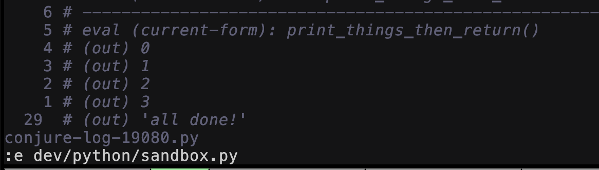

# conjurex - Experimental clients for [Conjure](https://github.com/Olical/conjure)

This repo is for seeing what works for me. It's not part of Conjure so I'm free
to make things work for my needs without worrying about the main Conjure
clients.

It's also an example of how to make your own Conjure client for your favorite programming
language. After cloning the repo, you can copy another language client like the Ruby
one and modify it for your programming language.

After generating the tags file (`:helptags doc` in the repo directory), you should be able
to use `:he conjurex` to access the help documentation for Conjurex clients.


## Goals

- Find out what works for me (the owner of this repo).
- Smooth integration with Conjure without being included in Conjure.
- Learn more about about Fennel, Lua, and writing Neovim plugins.
- Write tests using `busted` and `luaasert` to provide safety nets during my
experiments.
- Make it easy for others to test drive these clients with Conjure.
- Contribute to Conjure if things work out.
- Have a different client implementation in parallel with the one in Conjure.

## About me

- Contributed small changes to make evaluating Python *forms* (statements, expressions,
etc.) easier.
- Created the **SQL** and **snd-s7** clients.
- Helped with the [migration](https://github.com/Olical/conjure/discussions/605)
of Conjure off of [Aniseed](https://github.com/Olical/aniseed) and onto
[nfnl](https://github.com/Olical/nfnl).

## Clients

### Ruby

*01/02/2026: The code for this client was merged into
[Conjure](https://github.com/Olical/conjure) with [commit 5c69263](https://github.com/Olical/conjure/commit/5c692630257a02696dec59adcef4127f7cd11b62).*


### Elixir

*01/02/2026: The code for this client was merged into
[Conjure](https://github.com/Olical/conjure) with [commit 6770556](https://github.com/Olical/conjure/commit/67705566318002cc0a88b075f695518a43aa0ca7).*


### Python

*04/17/2026: Working*

The original Python client was created by someone else.

From the language user's perspective, things should *just work*. The big challenge for
this client comes from Python not being a `Lisp` language.

The Python client has to deal with the notion of `return value` vs `printed output`. This
Python client reports whatever is returned by the Python REPL. There is not attempt to
distinguish between a value and printed output. This allows you to have the HUD (heads-up
display) and the Conjure log buffer closed.

The output/return value is munged into one line of virtual text in the code buffer. When
you want to see things in a more natural format, open the Conjure log buffer.


#### How to use this Python client

- Add it to your plugin manager's configuration and install it.
- Configure your Conjure plugin to use `conjurex.client.python.stdio` as the filetype
handler for Python files.
    ```lua
    -- Lua config
    vim.g["conjure#filetype#python"] = "conjurex.client.python.stdio"
    ```
    or
    ```vimscript
    " Vimscript config
    let g:conjure#filetype#python = "conjurex.client.python.stdio"
    ```

#### Using this Python client

When evaluating code snippets, you can see the output in a single line in virtual text.

<figure>
    
    <figcaption>Fig. 1 - Printed output</figcaption>
</figure>
<br>

<figure>
    
    <figcaption>Fig. 2 - Numeric return value</figcaption>
</figure>
<br>

<figure>
    
    <figcaption>Fig. 3 - String return value</figcaption>
</figure>
<br>

When an error occurs, just the error message is returned; not the entire traceback.

<figure>
    
    <figcaption>Fig. 4 - Error message</figcaption>
</figure>
<br>

Multi-line output and return value are combined into one line of virtual text in the code
buffer. You'll need to open the Conjure log buffer associated with the code buffer to see
a better format of the output and return value.

<figure>
    
    <figcaption>Fig. 5 - Printed output and return value in code buffer</figcaption>
</figure>
<br>

<figure>
    
    <figcaption>Fig. 6 - Printed output and return value in log buffer</figcaption>
</figure>
<br>


